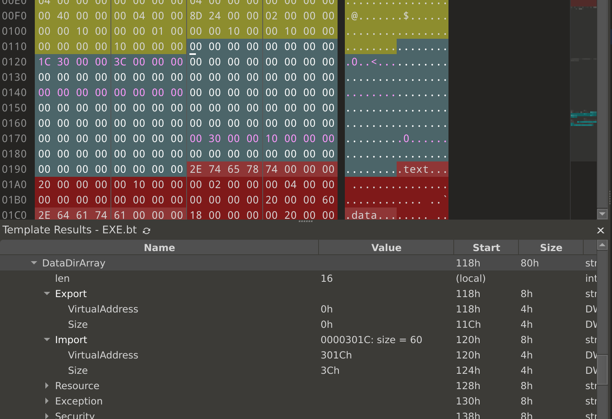
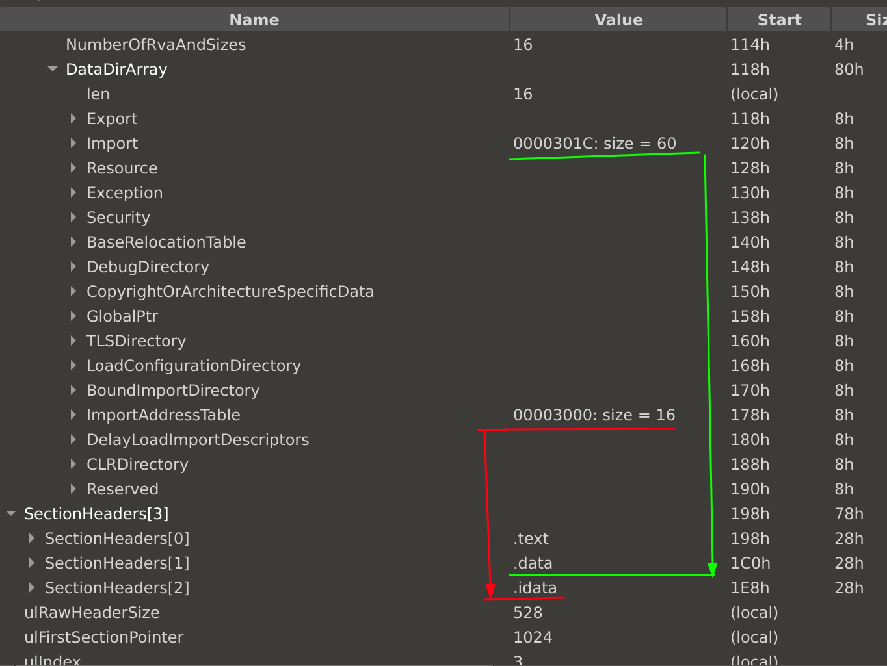

Таблица секций (Section Table)
===================================



### **Таблица секций в PE-файле**

Таблица секций (Section Table) является частью PE-заголовка и описывает секции, которые составляют содержимое исполняемого файла. Каждая секция представляет собой блок данных, содержащий код, данные, ресурсы и другую информацию, необходимую для работы приложения.

---

### **Структура записи таблицы секций**

Каждая запись таблицы секций состоит из следующих полей:

1. **`Name`**
   - Имя секции (8 байт).
   - Примеры: `.text`, `.data`, `.rdata`, `.bss`.
   - Если имя длиннее 8 символов, используется специальная таблица строк.

2. **`VirtualSize`**
   - Размер секции в памяти (в байтах).
   - Может быть больше размера секции на диске (`SizeOfRawData`), чтобы учесть данные, которые будут инициализированы в памяти.

3. **`VirtualAddress`**
   - Смещение секции от базового адреса загрузки (`ImageBase`).
   - Используется для вычисления виртуальных адресов.

4. **`SizeOfRawData`**
   - Размер секции на диске (в байтах).
   - Обычно это округление `VirtualSize` до выравнивания (`FileAlignment`).

5. **`PointerToRawData`**
   - Смещение секции в файле (в байтах от начала файла).

6. **`Characteristics`**
   - Набор флагов, описывающих свойства секции (например, содержит ли секция код, данные, исполняемый код, доступна ли запись).

---

### **Типы секций и их назначение**

#### **1. `.text`**
   - **Назначение:**  
     Содержит исполняемый код программы.
   - **Флаги `Characteristics`:**  
     - `IMAGE_SCN_CNT_CODE`: Секция содержит код.
     - `IMAGE_SCN_MEM_EXECUTE`: Код может быть выполнен.
     - `IMAGE_SCN_MEM_READ`: Код доступен для чтения.
   - в файле есть

#### **2. `.data`**
   - **Назначение:**  
     Содержит инициализированные данные.
   - **Флаги `Characteristics`:**  
     - `IMAGE_SCN_CNT_INITIALIZED_DATA`: Секция содержит инициализированные данные.
     - `IMAGE_SCN_MEM_READ`: Данные доступны для чтения.
     - `IMAGE_SCN_MEM_WRITE`: Данные могут быть изменены.

#### **3. `.bss`**
   - **Назначение:**  
     Содержит неинициализированные данные (глобальные переменные).  
     Эта секция не занимает места в файле, но выделяется в памяти при загрузке.
   - **Флаги `Characteristics`:**  
     - `IMAGE_SCN_CNT_UNINITIALIZED_DATA`: Секция содержит неинициализированные данные.
     - `IMAGE_SCN_MEM_READ` и `IMAGE_SCN_MEM_WRITE`.

#### **4. `.rdata`**
   - **Назначение:**  
     Содержит данные, доступные только для чтения, такие как строки, таблицы импорта/экспорта.
   - **Флаги `Characteristics`:**  
     - `IMAGE_SCN_CNT_INITIALIZED_DATA`: Инициализированные данные.
     - `IMAGE_SCN_MEM_READ`: Только чтение.

#### **5. `.edata`**
   - **Назначение:**  
     Содержит таблицу экспорта (для DLL-файлов).
   - **Флаги `Characteristics`:**  
     - `IMAGE_SCN_CNT_INITIALIZED_DATA`.
     - `IMAGE_SCN_MEM_READ`.

#### **6. `.idata`**
   - **Назначение:**  
     Содержит таблицу импорта (список DLL и функций, которые используются программой).
   - **Флаги `Characteristics`:**  
     - `IMAGE_SCN_CNT_INITIALIZED_DATA`.
     - `IMAGE_SCN_MEM_READ`.

#### **7. `.rsrc`**
   - **Назначение:**  
     Содержит ресурсы программы, такие как иконки, строки, диалоги.
   - **Флаги `Characteristics`:**  
     - `IMAGE_SCN_CNT_INITIALIZED_DATA`.
     - `IMAGE_SCN_MEM_READ`.

#### **8. `.reloc`**
   - **Назначение:**  
     Содержит таблицу перекомпонования (Base Relocation Table), используемую для динамической загрузки.
   - **Флаги `Characteristics`:**  
     - `IMAGE_SCN_CNT_INITIALIZED_DATA`.
     - `IMAGE_SCN_MEM_READ`.

#### **9. `.tls`**
   - **Назначение:**  
     Содержит данные для потоков (Thread Local Storage).
   - **Флаги `Characteristics`:**  
     - `IMAGE_SCN_CNT_INITIALIZED_DATA`.
     - `IMAGE_SCN_MEM_READ` и `IMAGE_SCN_MEM_WRITE`.

---

### **Взаимодействие с таблицей секций**

- **Выравнивание:**  
  Каждая секция выравнивается на границу, заданную параметрами `SectionAlignment` (в памяти) и `FileAlignment` (в файле).
  
- **Загрузка в память:**  
  При загрузке ОС использует `VirtualAddress` и `VirtualSize`, чтобы выделить место для секции в виртуальной памяти. Если `VirtualSize > SizeOfRawData`, оставшаяся область заполняется нулями.

---

Если нужно, могу показать пример работы с таблицей секций, например, используя Python (`pefile`) или другую библиотеку!

Таблица секций sample.exe файла
=================================

| field | value | start | size | type | color | comment |
|----|----|----|----|----|----|----|
| &nbsp; DataDirArray |  | 118h | 80h | struct IMAGE_DATA_DIRECTORY_ARRAY | Fg: Bg:0x2E8D8D | 
| &nbsp; len | 16 | (local) |  | int |  | 
| &nbsp; Export |  | 118h | 8h | struct IMAGE_DATA_DIRECTORY | Fg: Bg:0x2E8D8D | IMAGE_DIRECTORY_ENTRY_EXPORT
| &nbsp; VirtualAddress | 0h | 118h | 4h | DWORD | Fg: Bg:0x2E8D8D | 
| &nbsp; Size | 0h | 11Ch | 4h | DWORD | Fg: Bg:0x2E8D8D | 
| &nbsp; Import | 0000301C: size = 60 | 120h | 8h | struct IMAGE_DATA_DIRECTORY | Fg:0xFF00FF Bg:0x2E8D8D | IMAGE_DIRECTORY_ENTRY_IMPORT
| &nbsp; VirtualAddress | 301Ch | 120h | 4h | DWORD | Fg:0xFF00FF Bg:0x2E8D8D | .idata FOA = 0x81C 
| &nbsp; Size | 3Ch | 124h | 4h | DWORD | Fg:0xFF00FF Bg:0x2E8D8D | 
| &nbsp; Resource |  | 128h | 8h | struct IMAGE_DATA_DIRECTORY | Fg: Bg:0x2E8D8D | IMAGE_DIRECTORY_ENTRY_RESOURCE
| &nbsp; VirtualAddress | 0h | 128h | 4h | DWORD | Fg: Bg:0x2E8D8D | 
| &nbsp; Size | 0h | 12Ch | 4h | DWORD | Fg: Bg:0x2E8D8D | 
| &nbsp; Exception |  | 130h | 8h | struct IMAGE_DATA_DIRECTORY | Fg: Bg:0x2E8D8D | IMAGE_DIRECTORY_ENTRY_EXCEPTION
| &nbsp; VirtualAddress | 0h | 130h | 4h | DWORD | Fg: Bg:0x2E8D8D | 
| &nbsp; Size | 0h | 134h | 4h | DWORD | Fg: Bg:0x2E8D8D | 
| &nbsp; Security |  | 138h | 8h | struct IMAGE_DATA_DIRECTORY | Fg: Bg:0x2E8D8D | IMAGE_DIRECTORY_ENTRY_SECURITY
| &nbsp; VirtualAddress | 0h | 138h | 4h | DWORD | Fg: Bg:0x2E8D8D | 
| &nbsp; Size | 0h | 13Ch | 4h | DWORD | Fg: Bg:0x2E8D8D | 
| &nbsp; BaseRelocationTable |  | 140h | 8h | struct IMAGE_DATA_DIRECTORY | Fg:0xFF00FF Bg:0x2E8D8D | IMAGE_DIRECTORY_ENTRY_BASERELOC
| &nbsp; VirtualAddress | 0h | 140h | 4h | DWORD | Fg:0xFF00FF Bg:0x2E8D8D | 
| &nbsp; Size | 0h | 144h | 4h | DWORD | Fg:0xFF00FF Bg:0x2E8D8D | 
| &nbsp; DebugDirectory |  | 148h | 8h | struct IMAGE_DATA_DIRECTORY | Fg: Bg:0x2E8D8D | IMAGE_DIRECTORY_ENTRY_DEBUG
| &nbsp; VirtualAddress | 0h | 148h | 4h | DWORD | Fg: Bg:0x2E8D8D | 
| &nbsp; Size | 0h | 14Ch | 4h | DWORD | Fg: Bg:0x2E8D8D | 
| &nbsp; CopyrightOrArchitectureSpecificData |  | 150h | 8h | struct IMAGE_DATA_DIRECTORY | Fg: Bg:0x2E8D8D | IMAGE_DIRECTORY_ENTRY_ARCHITECTURE
| &nbsp; VirtualAddress | 0h | 150h | 4h | DWORD | Fg: Bg:0x2E8D8D | 
| &nbsp; Size | 0h | 154h | 4h | DWORD | Fg: Bg:0x2E8D8D | 
| &nbsp; GlobalPtr |  | 158h | 8h | struct IMAGE_DATA_DIRECTORY | Fg: Bg:0x2E8D8D | IMAGE_DIRECTORY_ENTRY_GLOBALPTR
| &nbsp; VirtualAddress | 0h | 158h | 4h | DWORD | Fg: Bg:0x2E8D8D | 
| &nbsp; Size | 0h | 15Ch | 4h | DWORD | Fg: Bg:0x2E8D8D | 
| &nbsp; TLSDirectory |  | 160h | 8h | struct IMAGE_DATA_DIRECTORY | Fg: Bg:0x2E8D8D | IMAGE_DIRECTORY_ENTRY_TLS
| &nbsp; VirtualAddress | 0h | 160h | 4h | DWORD | Fg: Bg:0x2E8D8D | 
| &nbsp; Size | 0h | 164h | 4h | DWORD | Fg: Bg:0x2E8D8D | 
| &nbsp; LoadConfigurationDirectory |  | 168h | 8h | struct IMAGE_DATA_DIRECTORY | Fg: Bg:0x2E8D8D | IMAGE_DIRECTORY_ENTRY_LOAD_CONFIG
| &nbsp; VirtualAddress | 0h | 168h | 4h | DWORD | Fg: Bg:0x2E8D8D | 
| &nbsp; Size | 0h | 16Ch | 4h | DWORD | Fg: Bg:0x2E8D8D | 
| &nbsp; BoundImportDirectory |  | 170h | 8h | struct IMAGE_DATA_DIRECTORY | Fg: Bg:0x2E8D8D | IMAGE_DIRECTORY_ENTRY_BOUND_IMPORT
| &nbsp; VirtualAddress | 0h | 170h | 4h | DWORD | Fg: Bg:0x2E8D8D | 
| &nbsp; Size | 0h | 174h | 4h | DWORD | Fg: Bg:0x2E8D8D | 
| &nbsp; ImportAddressTable | 00003000: size = 16 | 178h | 8h | struct IMAGE_DATA_DIRECTORY | Fg:0xFF00FF Bg:0x2E8D8D | IMAGE_DIRECTORY_ENTRY_IAT
| &nbsp; VirtualAddress | 3000h | 178h | 4h | DWORD | Fg:0xFF00FF Bg:0x2E8D8D | .idata FOA = 0x800 
| &nbsp; Size | 10h | 17Ch | 4h | DWORD | Fg:0xFF00FF Bg:0x2E8D8D | 
| &nbsp; DelayLoadImportDescriptors |  | 180h | 8h | struct IMAGE_DATA_DIRECTORY | Fg: Bg:0x2E8D8D | IMAGE_DIRECTORY_ENTRY_DELAY_IMPORT
| &nbsp; VirtualAddress | 0h | 180h | 4h | DWORD | Fg: Bg:0x2E8D8D | 
| &nbsp; Size | 0h | 184h | 4h | DWORD | Fg: Bg:0x2E8D8D | 
| &nbsp; CLRDirectory |  | 188h | 8h | struct IMAGE_DATA_DIRECTORY | Fg: Bg:0x2E8D8D | IMAGE_DIRECTORY_ENTRY_CLR
| &nbsp; VirtualAddress | 0h | 188h | 4h | DWORD | Fg: Bg:0x2E8D8D | 
| &nbsp; Size | 0h | 18Ch | 4h | DWORD | Fg: Bg:0x2E8D8D | 
| &nbsp; Reserved |  | 190h | 8h | struct IMAGE_DATA_DIRECTORY | Fg: Bg:0x2E8D8D | System Reserved
| &nbsp; VirtualAddress | 0h | 190h | 4h | DWORD | Fg: Bg:0x2E8D8D | 
| &nbsp; Size | 0h | 194h | 4h | DWORD | Fg: Bg:0x2E8D8D | 


Разбор
=============================



По ходу секции 
- .data  и import
- .idata и importAddressTable 

связаны между собой

Связь между секциями `.data`, `.idata` и соответствующими таблицами (`Import Directory` и `Import Address Table`) в PE-файле реализуется через **Data Directory Array**. Этот массив хранит указатели на важные структуры данных PE-файла, такие как таблицы импорта, экспорта, ресурсов и другие.

---

### **1. Секция `.data` и Import Table (в Data Directory Array)**

- **Назначение секции `.data`:**
  - Содержит глобальные переменные программы, которые инициализированы в исходном коде.
  - Может включать в себя области, связанные с таблицами импорта, если программа работает с глобальными переменными, инициализированными импортируемыми функциями.

- **Связь с таблицей импорта (Import Table):**
  - В Data Directory Array есть запись с индексом `IMAGE_DIRECTORY_ENTRY_IMPORT` (обычно 1), которая указывает на таблицу импорта (Import Directory Table).
  - Таблица импорта хранит информацию о всех DLL, которые используются программой, и функциях, импортируемых из этих DLL.
  - **Таблица импорта может быть частью секции `.data`**, но чаще находится в секции `.idata` (или в отдельной).

- **Практическая связь:**
  - Секция `.data` может использовать данные из таблицы импорта, например, указатели на импортируемые функции, чтобы инициализировать глобальные переменные.

---

### **2. Секция `.idata` и Import Address Table (IAT)**

- **Назначение секции `.idata`:**
  - Содержит структуру, необходимую для динамической загрузки импортируемых DLL и функций.  
  - Включает:
    - Таблицу импорта (Import Directory Table).
    - Import Name Table (INT): список имен функций и DLL.
    - Import Address Table (IAT): таблица указателей, которая используется во время выполнения.

- **Связь с Import Address Table (IAT):**
  - В Data Directory Array есть запись с индексом `IMAGE_DIRECTORY_ENTRY_IAT` (обычно 12), которая указывает на начало IAT.
  - **IAT является частью секции `.idata`** и содержит указатели на адреса импортируемых функций.
  - После загрузки программы и разрешения всех импортов загрузчиком ОС, IAT обновляется реальными адресами функций в памяти.

---

### **Как они работают вместе**

1. **Инициализация программы:**
   - При загрузке программы ОС читает Import Directory Table (часть секции `.idata`) через указатель в Data Directory Array.
   - Загрузчик находит и загружает необходимые DLL, извлекает адреса функций, которые требуются программе.

2. **Заполнение Import Address Table (IAT):**
   - Указатели в IAT (часть `.idata`) обновляются реальными адресами функций.
   - Эти адреса могут использоваться программой напрямую или для инициализации переменных, хранящихся в `.data`.

3. **Пример взаимодействия:**
   - Программа объявляет глобальную переменную, инициализированную указателем на импортируемую функцию:
     ```c
     void (*MyFunc)() = MessageBoxA;
     ```
   - Адрес функции `MessageBoxA` импортируется через IAT и может быть записан в секцию `.data` для инициализации `MyFunc`.

---

### **Итоговая связь**

| **Элемент**             | **Секция**      | **Роль**                                                       |
|--------------------------|-----------------|----------------------------------------------------------------|
| Import Directory Table   | `.idata`        | Описывает DLL и функции, импортируемые программой.             |
| Import Address Table (IAT)| `.idata`        | Указатели на адреса импортируемых функций, обновляемые загрузчиком. |
| Глобальные переменные    | `.data`         | Могут ссылаться на функции из IAT или использовать данные из таблицы импорта. |
