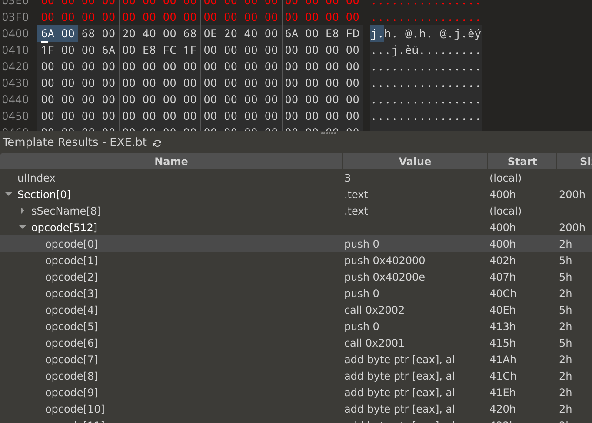
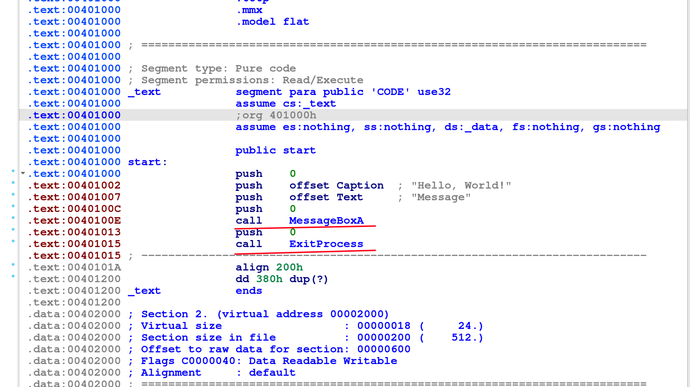

Секция .text - код
===============================

Заголовок
------------------

Структура заголовка секции `.text` в PE-файле описывается с использованием записи таблицы секций (Section Table). Этот заголовок предоставляет информацию о расположении, размере и характеристиках секции `.text`. Он занимает 40 байт и имеет следующий вид:

---

### **Структура заголовка секции `.text`**

| Поле                   | Описание                                                       | Размер (в байтах) |
|------------------------|---------------------------------------------------------------|-------------------|
| **`Name`**             | Имя секции (например, `.text`).                               | 8                 |
| **`VirtualSize`**      | Размер секции в памяти (в байтах).                            | 4                 |
| **`VirtualAddress`**   | Виртуальный адрес секции относительно `ImageBase`.            | 4                 |
| **`SizeOfRawData`**    | Размер секции на диске (в байтах).                            | 4                 |
| **`PointerToRawData`** | Смещение секции в файле (в байтах).                           | 4                 |
| **`PointerToRelocations`** | Смещение до информации о релокациях (не используется для `.text`). | 4                 |
| **`PointerToLinenumbers`** | Смещение до информации о строках исходного кода (обычно 0). | 4                 |
| **`NumberOfRelocations`** | Количество записей о релокациях (обычно 0 для `.text`).      | 2                 |
| **`NumberOfLinenumbers`** | Количество записей о строках исходного кода (обычно 0).      | 2                 |
| **`Characteristics`**  | Флаги, описывающие свойства секции (например, исполняемая).   | 4                 |

---

### **Описание ключевых полей**

#### **1. Name**
- Имя секции, часто `.text`.  
- Хранится как строка длиной до 8 символов, дополняется нулями, если строка короче.

#### **2. VirtualSize**
- Размер секции в памяти (в байтах).  
- Может быть больше, чем фактический размер на диске (`SizeOfRawData`), чтобы учесть данные, которые заполняются нулями при загрузке.

#### **3. VirtualAddress**
- Виртуальный адрес секции, относительно `ImageBase`.  
- Это смещение, по которому секция будет загружена в память.  
- Обычно `.text` имеет первый виртуальный адрес после заголовков PE.

#### **4. SizeOfRawData**
- Размер секции на диске (в байтах).  
- Это количество байтов, выделяемое в PE-файле для хранения секции.  
- Обычно округляется до ближайшего выравнивания (`FileAlignment`).

#### **5. PointerToRawData**
- Смещение до начала секции в файле (от начала PE-файла).  
- Указывает, где начинается секция `.text` в самом файле.

#### **6. Characteristics**
- Флаги, описывающие свойства секции.  
- Для секции `.text` обычно используются следующие флаги:
  - `IMAGE_SCN_CNT_CODE` (`0x00000020`): Секция содержит код.
  - `IMAGE_SCN_MEM_EXECUTE` (`0x20000000`): Код может быть выполнен.
  - `IMAGE_SCN_MEM_READ` (`0x40000000`): Код доступен для чтения.

---

### **Пример данных заголовка секции `.text`**

Для примера возьмём гипотетический заголовок `.text`:

| Поле                   | Значение            |
|------------------------|---------------------|
| **Name**               | `.text\0\0\0`       |
| **VirtualSize**        | `0x00003000` (12 КБ)|
| **VirtualAddress**     | `0x00001000`        |
| **SizeOfRawData**      | `0x00002000` (8 КБ) |
| **PointerToRawData**   | `0x00000400`        |
| **Characteristics**    | `0x60000020`        |

#### Интерпретация:
- Секция `.text` начинается с виртуального адреса `0x00001000` (относительно `ImageBase`).
- В памяти она займёт 12 КБ, но на диске хранится только 8 КБ (оставшиеся 4 КБ будут заполнены нулями).
- Данные секции начинаются в файле с байта `0x00000400`.

Сама секция
=============================





Сами адреса выозва преобразуются из call 0x2002 и call 0x2001 в адреса целевых функций магическим образом

про опкод e8 (call)
----------------

Опкод **`E8`** на архитектуре Intel i586 (и более современных x86) используется для выполнения инструкции **`CALL`** (вызов процедуры) с использованием относительной адресации.

---

### **Описание опкода `E8`**

- **Инструкция:** `CALL rel32`
- **Назначение:**  
  Выполняет вызов функции или процедуры, сохраняя адрес возврата (текущий `EIP`/`RIP` + длина инструкции) в стеке и переходя по указанному относительному смещению.

- **Формат:**  
  ```
  E8 [rel32]
  ```
  - `E8` — код операции (`CALL rel32`).
  - `rel32` — 32-битное относительное смещение от текущего адреса (указателя инструкции `EIP`) до адреса начала вызываемой функции.

- **Размер инструкции:** 5 байт:
  - 1 байт — опкод `E8`.
  - 4 байта — смещение `rel32`.

---

### **Работа инструкции**

1. **Сохранение адреса возврата:**
   - Текущий адрес возврата (`EIP` после `E8` + 4 байта) сохраняется в стеке.
   - Это позволяет функции вернуться к следующей инструкции после завершения.

2. **Вычисление адреса перехода:**
   - Адрес перехода = текущий `EIP` + длина инструкции + `rel32`.
   - `rel32` может быть положительным (переход вперёд) или отрицательным (переход назад).

3. **Переход к новой инструкции:**
   - Управление передаётся по вычисленному адресу.

---

### **Пример работы**

#### Ассемблерный код:
```asm
CALL MyFunction
```

#### Машинный код (в бинарном виде):
```
E8 1A 00 00 00
```

- `E8` — вызов с относительным смещением.
- `1A 00 00 00` — смещение `rel32 = 0x1A` (26 байт вперёд от текущей инструкции).

#### Расшифровка:
1. **Текущий `EIP`:** допустим, `0x00400000` (адрес начала `CALL`).
2. **Длина инструкции:** 5 байт.
3. **Адрес перехода:**  
   ```
   Адрес перехода = 0x00400000 + 5 + 0x1A = 0x0040001F
   ```
4. **Сохранение адреса возврата в стек:**  
   В стек записывается `0x00400005` (следующая инструкция после `CALL`).

---

### **Особенности и использование**

1. **Обратные вызовы (переход назад):**
   Если вызываемая функция расположена перед вызовом `CALL`, `rel32` будет отрицательным числом. Например, `rel32 = -0x1A` указывает на переход назад.

2. **Пример с переходом назад:**
   ```asm
   00400005: E8 E1 FF FF FF   ; CALL -0x1F (переход назад на 31 байт)
   ```

3. **Использование в связке с PUSH и RET:**
   - Инструкция `CALL` автоматически выполняет операцию `PUSH` для сохранения адреса возврата.
   - Для возврата из функции используется инструкция `RET`, которая извлекает адрес возврата из стека.

---

### **Пример в контексте программы**

#### Пример кода на C:
```c
#include <stdio.h>

void MyFunction() {
    printf("Hello from MyFunction!\n");
}

int main() {
    MyFunction();
    return 0;
}
```

#### Скомпилированный ассемблер:
```asm
CALL MyFunction ; Использует E8
...
MyFunction:
    ; Тело функции
```

#### Машинный код:
```
E8 [смещение к MyFunction]
```

Относительный адрес `rel32` в инструкции `CALL` может быть связан с таблицей импорта, если инструкция вызывает функцию, которая была импортирована из динамической библиотеки (DLL). Эта связь реализуется через **Import Address Table (IAT)**, которая содержит адреса функций, загружаемых из DLL.

---

### **Как `rel32` связан с таблицей импорта?**

1. **Таблица импорта (Import Address Table, IAT):**
   - Во время загрузки PE-файла операционная система (Windows Loader) заполняет IAT фактическими адресами импортируемых функций.
   - Каждый элемент IAT — это указатель на функцию, загруженную из DLL.

2. **Вызов через `CALL`:**
   - Если функция импортируется из DLL, `rel32` указывает на запись в IAT.
   - Таким образом, инструкция `CALL` переходит к адресу, хранящемуся в соответствующей ячейке IAT.

3. **Адрес перехода:**
   - При загрузке программы, IAT находится в заранее определённой секции (обычно `.idata` или `.rdata`) и доступна в памяти.
   - Адрес перехода, вычисляемый инструкцией `CALL`, указывает на запись в IAT.
   - IAT уже содержит фактический адрес функции, загруженный из соответствующей DLL.

---

### **Пример: вызов импортируемой функции**

#### 1. Программа использует функцию `MessageBoxA` из `user32.dll`:
```c
#include <windows.h>
int main() {
    MessageBoxA(NULL, "Hello", "Title", MB_OK);
    return 0;
}
```

#### 2. Таблица импорта в PE-файле:
В таблице импорта указаны:
- Имя DLL (`user32.dll`).
- Имя функции (`MessageBoxA`).
- Import Address Table (IAT) содержит адрес, куда загрузчик запишет фактический адрес `MessageBoxA`.

#### 3. Инструкция `CALL` в ассемблере:
```asm
CALL DWORD PTR [0x00403000] ; указатель на IAT
```

#### 4. Машинный код:
```
E8 [rel32]
```

- `rel32` вычисляется как:  
  ```
  rel32 = AddressInIAT - (CurrentEIP + 5)
  ```

---

### **Как адрес перехода формируется в целевой?**

1. **До загрузки:**
   - В PE-файле `IAT` заполняется временными значениями (обычно заглушками, например, адресом `thunk`).

2. **Во время загрузки:**
   - Загрузчик Windows (Windows Loader) читает таблицу импорта (Import Directory Table), загружает `user32.dll`, ищет адрес `MessageBoxA`, и записывает этот адрес в соответствующую ячейку IAT.

3. **При выполнении:**
   - Инструкция `CALL` вычисляет адрес перехода:
     - В инструкции `E8` используется `rel32`, чтобы вычислить адрес ячейки в IAT.
     - Из ячейки IAT читается адрес реальной функции (например, `0x76A01234` для `MessageBoxA`).
     - Управление передаётся по этому адресу.

---

### **Итоговая связь**

- **`rel32`** указывает на запись в Import Address Table.
- **IAT** заполняется загрузчиком реальными адресами функций.
- Вызов через `CALL` приводит к переходу на фактический адрес функции в DLL.

Если нужно, могу показать более детальный пример с разбором машинного кода или выводом отладчика!